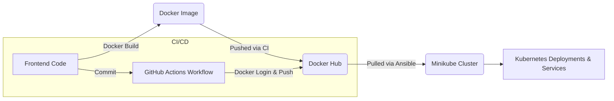

# Fully Automated based DevOps Project 🥥

## Overview 🌴
This project is a **fully automated DevOps pipeline** for deploying a fun summer-themed "Coconut Website" using a combination of **Docker, GitHub Actions, Ansible, and Kubernetes (Minikube)**. It showcases the power of Infrastructure as Code (IaC), CI/CD pipelines, and container orchestration in a clean and reusable structure.


## Tools Used 📦 



## 🛠️ What Each Tool Does

| Tool            | Purpose                                                                 |
|----------------|-------------------------------------------------------------------------|
| **Docker**     | Containerizes the Coconut frontend app.                                 |
| **GitHub Actions** | Automatically builds & pushes Docker image to DockerHub on commit.      |
| **Ansible**    | Pulls the Docker image and applies Kubernetes manifests.                |
| **Minikube**   | Hosts the Kubernetes cluster locally.                                   |
| **Kubernetes** | Manages the pods, services, and deployment of the app.                  |

## 🔄 Project Workflow 

1. **Code is pushed to GitHub**
2. **GitHub Actions** workflow triggers:
   - Logs into DockerHub
   - Builds the Docker image
   - Pushes the image to DockerHub with tag `v1`
3. You run a single command:
   ```bash
   ansible-playbook -i ansible/inventory/hosts.ini ansible/playbook.yaml
   ```
4. **Ansible** does the following:
   - Pulls the Docker image from DockerHub
   - Applies Kubernetes manifests (deployment & service)
5. **Kubernetes on Minikube** starts the pods and exposes your app
6. Access the app using:
   ```bash
   minikube service coco-frontend-service
   ```

## How to Run 🌱

### Prerequisites:
- **Minikube** installed and running.
- **DockerHub** account with your Docker credentials stored in GitHub Secrets.
- **kubectl** and **Ansible** set up locally.
- **GitHub Actions** workflows set up for continuous deployment.

---

## Why This Is A Strong DevOps Project 🔥 
- **CI/CD**: Automated end-to-end Docker build and push
- **IaC**: Everything from Kubernetes manifests to Ansible roles is code-defined
- **Real-time deployable**: Run one command to bring the cluster to life
- **Reusable**: Easily reset and redeploy anytime

---

### 🍍 Inspired by summer and built for learning — a Coconut DevOps dream!

